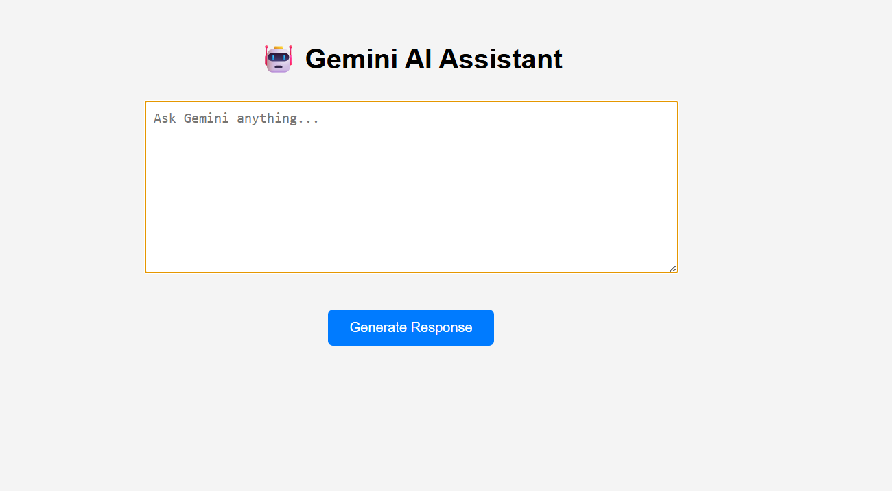
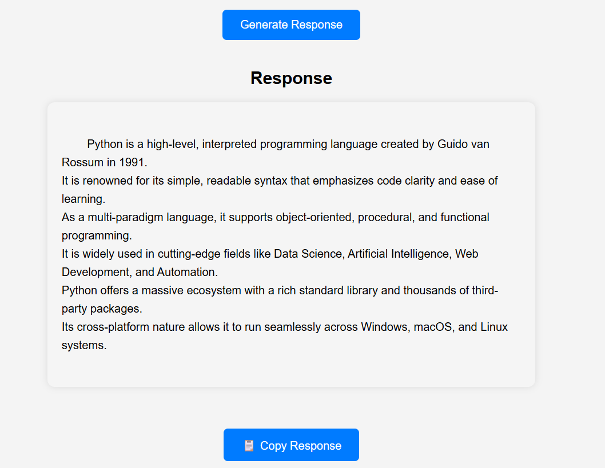
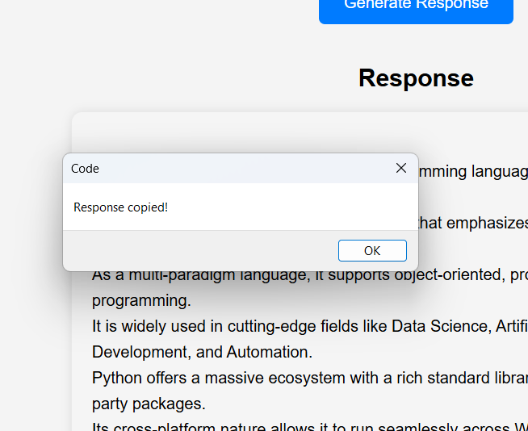

# 🤖 Gemini AI Assistant

A web-based AI Assistant built using **Python, Flask, and Google's Gemini API**. This application allows users to ask questions and receive AI-generated responses through a simple, interactive web interface.

---

## 🚀 Features

- Ask questions using a clean web interface
- AI-powered responses using Google Gemini
- Concise and user-friendly answers
- Secure API key management using `.env`
- Prompt remains visible after submission
- Copy AI response with a single click
- Simple and responsive UI

---

## 🛠️ Technologies Used

- Python
- Flask
- Google Gemini API
- HTML
- CSS
- Python Dotenv

---

## 📂 Project Structure

```
Gemini-Integration/
│
├── app.py
├── requirements.txt
├── README.md
├── .env
├── templates/
│   └── index.html
├── static/
│   └── style.css
└── images/
    ├── home.png
    ├── response.png
    └── copy-response.png
```

---

## ⚙️ Installation

Clone the repository:

```bash
git clone <repository-link>
```

Move into the project folder:

```bash
cd Gemini-Integration
```

Install the required packages:

```bash
pip install -r requirements.txt
```

Create a `.env` file and add your Gemini API key:

```env
GEMINI_API_KEY=YOUR_API_KEY
```

Run the application:

```bash
python app.py
```

Open your browser and visit:

```
http://127.0.0.1:5000
```

---

## 📸 Screenshots

### 🏠 Home Page



### 🤖 AI Response



### 📋 Copy Response Feature



---

## 💡 Example

**Input**

```
What is Artificial Intelligence?
```

**Output**

```
Artificial Intelligence (AI) is the simulation of human intelligence by machines. It enables computers to learn, reason, solve problems, and make decisions. AI is widely used in healthcare, finance, education, robotics, and many other industries.
```

---

## 🔮 Future Enhancements

- Chat history
- Dark mode
- Loading animation
- Multiple AI models
- Voice input support

---

## 👩‍💻 Author

**Vanshika**

Developed as part of my **QSkill Python Development Internship** to explore Generative AI, Flask web development, and Google Gemini API integration.