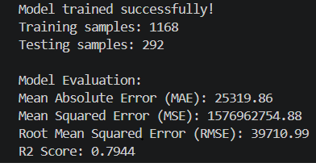
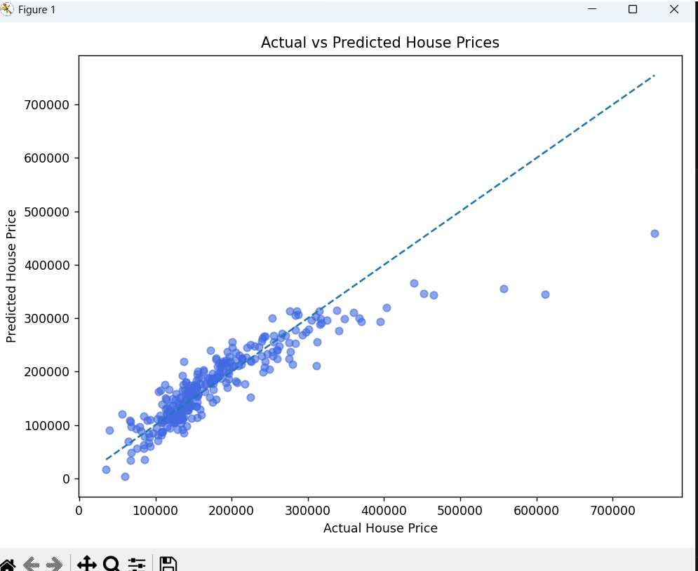
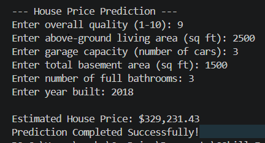

# 🏠 House Price Prediction using Linear Regression

## 📌 Project Overview
This project predicts house prices using the Linear Regression algorithm. It is trained on the Kaggle House Prices dataset and estimates the selling price of a house based on important features.

---

## 🎯 Objective
The objective of this project is to build a Machine Learning model that can predict house prices accurately using selected house features.

---

## 📂 Dataset
**Dataset:** Kaggle - House Prices: Advanced Regression Techniques

Training Dataset: `train.csv`

---

## ✨ Features Used
- OverallQual
- GrLivArea
- GarageCars
- TotalBsmtSF
- FullBath
- YearBuilt

---

## 🛠 Technologies Used
- Python
- Pandas
- NumPy
- Matplotlib
- Scikit-learn

---

## 🤖 Machine Learning Algorithm
- Linear Regression

---

## 📊 Model Performance

| Metric | Value |
|--------|--------|
| Mean Absolute Error (MAE) | 25319.86 |
| Mean Squared Error (MSE) | 1576962754.88 |
| Root Mean Squared Error (RMSE) | 39710.99 |
| R² Score | 0.7944 |

---

## 📈 Output
- Loads and preprocesses the dataset.
- Trains a Linear Regression model.
- Evaluates model performance.
- Displays an Actual vs Predicted House Prices graph.
- Predicts the estimated price of a new house based on user input.

---

## 🚀 How to Run

1. Install the required libraries:
```
pip install pandas numpy matplotlib scikit-learn
```

2. Run the project:
```
python main.py
```

---

## 📊 Sample Output

### Model Evaluation



### Actual vs Predicted House Prices



### House Price Prediction



---

## 👩‍💻 Author
**Vanshika**