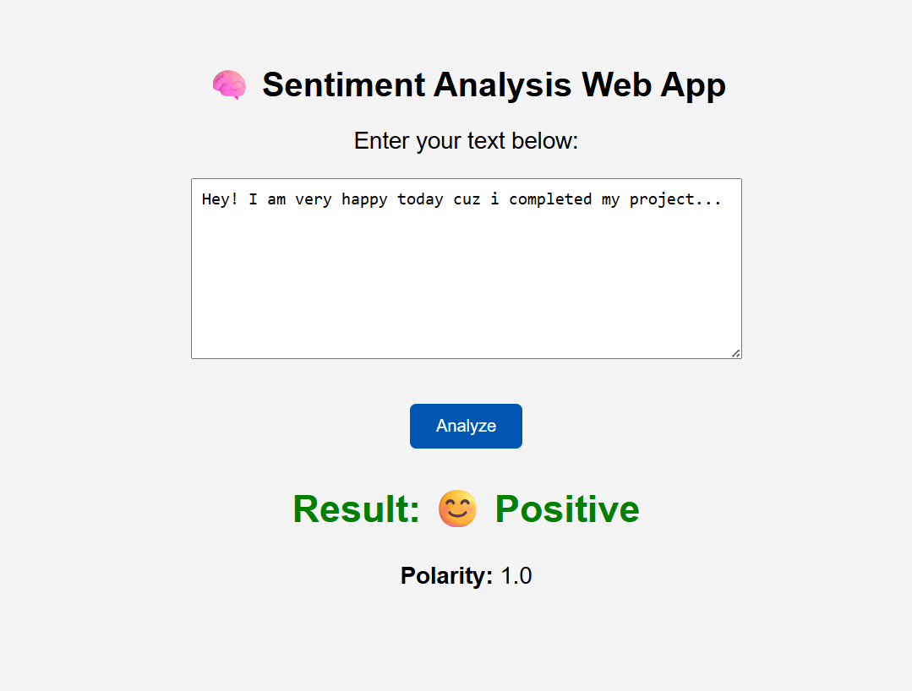
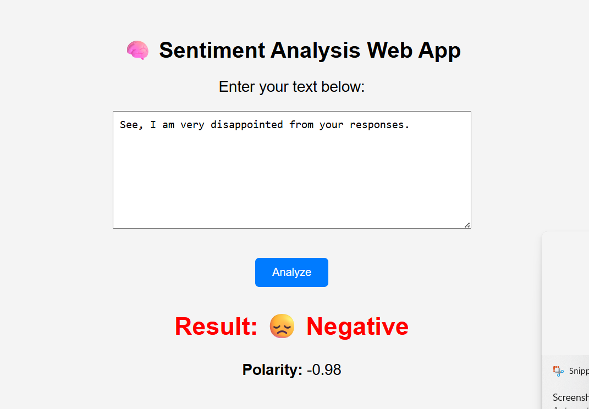
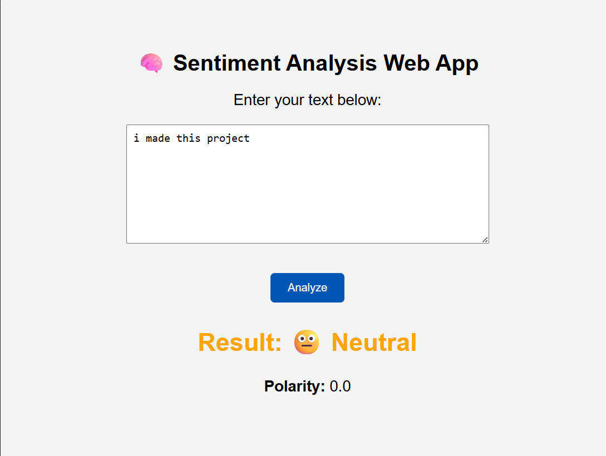

# 🧠 Sentiment Analysis Web App

A simple Sentiment Analysis Web Application built using **Python, Flask, and TextBlob**. This application analyzes the sentiment of the text entered by the user and classifies it as **Positive**, **Negative**, or **Neutral** along with a polarity score.

---

## 🚀 Features

- Analyze text sentiment instantly
- Detects Positive, Negative, and Neutral sentiments
- Displays sentiment polarity score
- Simple and user-friendly web interface
- Built using Flask framework

---

## 🛠️ Technologies Used

- Python
- Flask
- TextBlob
- HTML
- CSS

---

## 📂 Project Structure

```
Sentiment-Analysis-Web-App/
│
├── app.py
├── requirements.txt
├── README.md
├── templates/
│   └── index.html
├── static/
│   └── style.css
└── images/
    ├── positive.png
    ├── negative.png
    └── neutral.png
```

---

## ⚙️ Installation

Clone the repository:

```bash
git clone <repository-link>
```

Move into the project folder:

```bash
cd Sentiment-Analysis-Web-App
```

Install dependencies:

```bash
pip install -r requirements.txt
```

Run the application:

```bash
python app.py
```

Open your browser and visit:

```
http://127.0.0.1:5000
```

---

## 📸 Output

### 😊 Positive Sentiment



### ☹️ Negative Sentiment



### 😐 Neutral Sentiment



---

## 📌 Example

Input:
```
I am very happy today because I completed my project.
```

Output:
```
Result: 😊 Positive
Polarity: 1.0
```

---

## 👩‍💻 Author

**Vanshika**

Built as part of my Python Development Internship to learn Flask, TextBlob, and web application development.
