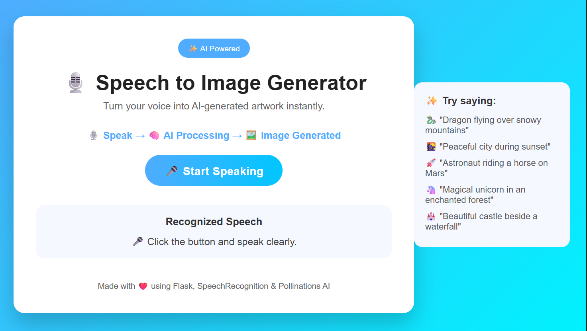
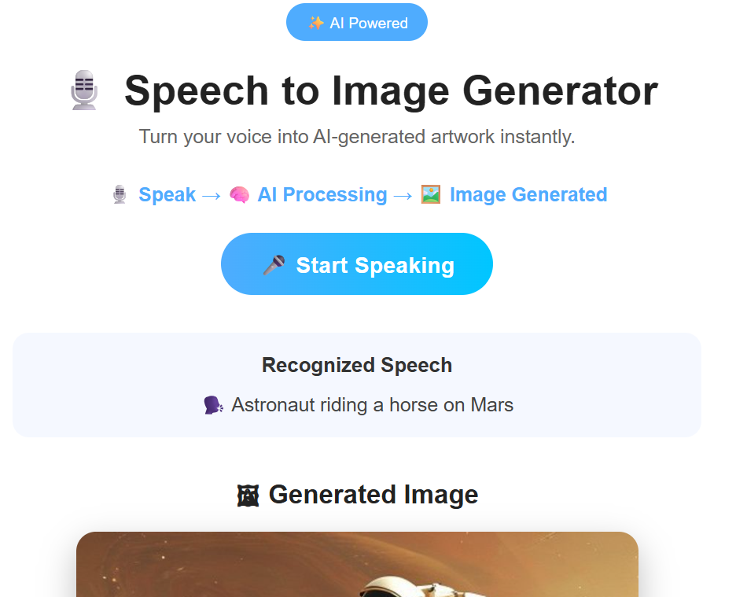
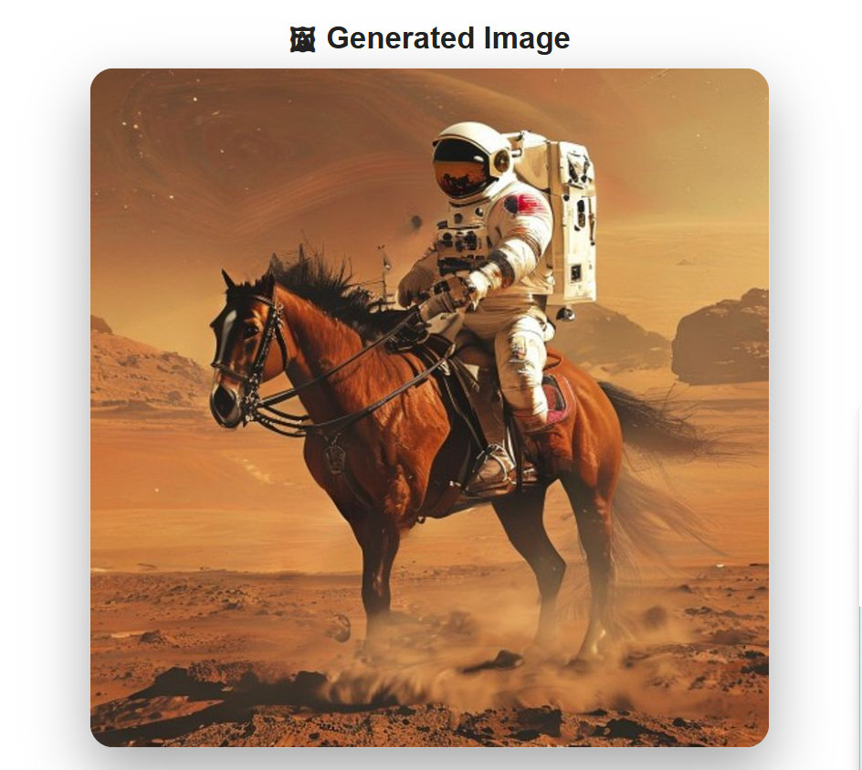

# 🎙️ Speech to Image Generator

An AI-powered Flask web application that converts spoken words into AI-generated images. The application captures voice input using Speech Recognition, converts it into text, and generates corresponding AI-generated images using Pollinations AI.

---

## ✨ Features

- 🎤 Voice Recognition using Microphone
- 🧠 Speech-to-Text Conversion
- 🖼️ AI Image Generation
- 🌐 Flask Web Application
- 📱 Responsive User Interface
- 🎨 Modern and Attractive Design
- 💡 Example Voice Prompts
- ⚡ Fast Image Generation

---

## 🛠️ Technologies Used

- Python
- Flask
- HTML5
- CSS3
- SpeechRecognition
- Requests
- Pollinations AI

---

## 📂 Project Structure

```
Speech-to-Image-Generator/
│
├── generated_images/
│   ├── home-page.png
│   ├── speech-recognition.png
│   └── generated-image.png
│
├── static/
│   └── style.css
│
├── templates/
│   └── index.html
│
├── app.py
├── requirements.txt
└── README.md
```

---

## 🚀 How to Run

### 1. Clone the Repository

```bash
git clone <repository-link>
```

### 2. Install Dependencies

```bash
pip install -r requirements.txt
```

### 3. Run the Application

```bash
python app.py
```

### 4. Open in Browser

```
http://127.0.0.1:5000
```

---

## 📸 Screenshots

### 🏠 Home Page



### 🎤 Speech Recognition



### 🖼️ Generated Image



---

## 🎯 Example Voice Prompts

- A dragon flying over snowy mountains
- A peaceful city during sunset
- An astronaut riding a horse on Mars
- A magical unicorn in an enchanted forest
- A beautiful castle beside a waterfall

---

## 📌 Future Improvements

- Support multiple AI image generation models
- Download generated images
- Voice language selection
- Image generation history
- Dark mode

---

## ❤️ Made With

Flask • SpeechRecognition • Pollinations AI

---

## 👩‍💻 About the Developer

**Vanshika**

B.Tech Computer Science Engineering Student

Passionate about Python Development, Artificial Intelligence, Machine Learning, and Data Analytics. Always eager to build practical projects and continuously enhance technical skills through hands-on learning.

⭐ Thank you for visiting this project. Feedback and suggestions are always welcome!