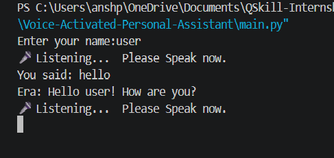
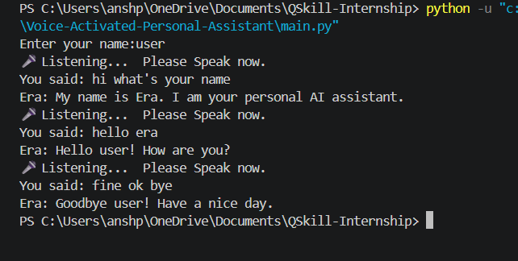
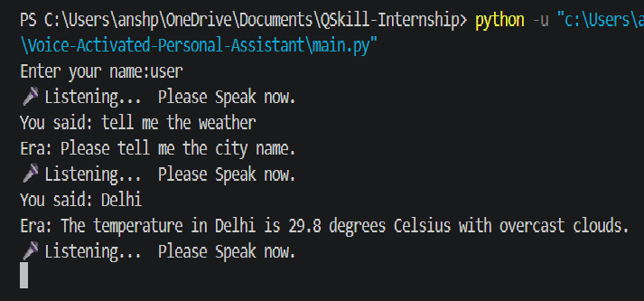
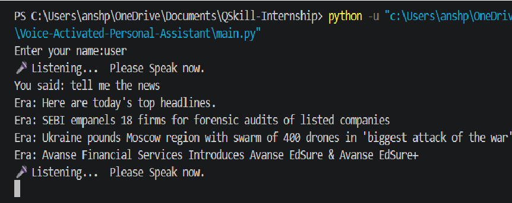
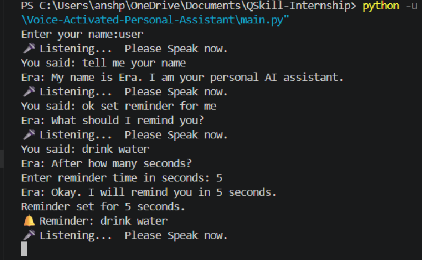
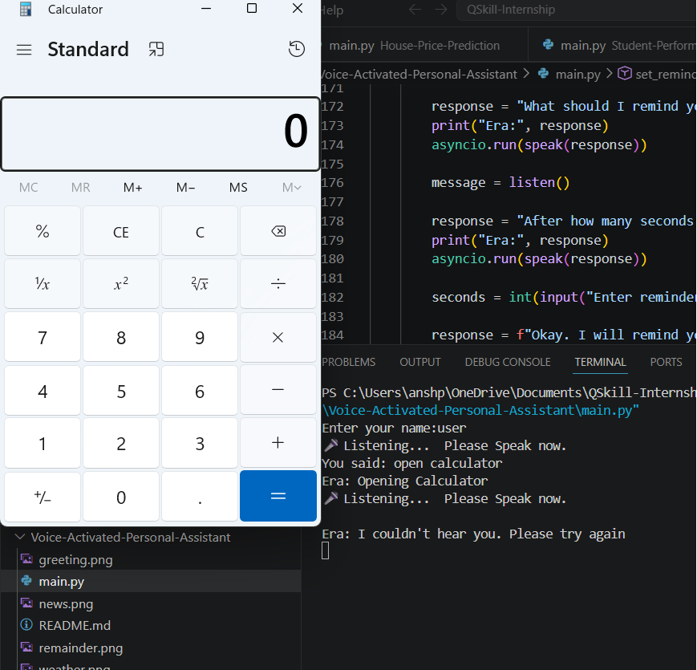
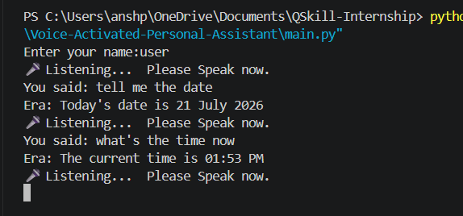

# 🎙️ Era - Voice Activated Personal Assistant

Era is a Python-based Voice Activated Personal Assistant that understands voice commands and performs everyday tasks such as opening applications, providing weather updates, reading the latest news, setting reminders, and answering simple queries using natural speech.

This project demonstrates the integration of Speech Recognition, Text-to-Speech, APIs, and Python automation to create an interactive AI assistant.

---

## ✨ Features

- 🎤 Voice Command Recognition
- 🗣️ Natural Female AI Voice (Microsoft Edge-TTS)
- 👤 Personalized Greeting
- 🌤️ Live Weather Updates
- 📰 Latest News Headlines
- 🌐 Open Google
- 💬 Open ChatGPT
- ▶️ Open YouTube
- 💻 Open Visual Studio Code
- 🧮 Open Calculator
- 📅 Tell Current Date
- ⏰ Tell Current Time
- 🔔 Voice Reminder with Beep Alert
- 🚪 Exit Command
- ⚠️ Error Handling for Unrecognized Commands

---

## 🛠️ Technologies Used

- Python
- SpeechRecognition
- Edge-TTS
- Requests
- Asyncio
- Playsound
- Winsound
- Webbrowser
- Datetime
- OpenWeatherMap API
- NewsAPI

---

## 📂 Project Structure

```
Voice-Activated-Personal-Assistant/
│
├── main.py
├── README.md
├── greeting.png
├── conversation.png
├── weather.png
├── news.png
├── reminder.png
├── calculator.png
└── date_and_time.png
```

---

## 🚀 Installation

### Clone the Repository

```bash
git clone https://github.com/your-username/Voice-Activated-Personal-Assistant.git
```

### Navigate to the Project

```bash
cd Voice-Activated-Personal-Assistant
```

### Install Dependencies

```bash
pip install -r requirements.txt
```

### Configure API Keys

Replace the following API keys in the source code:

- OpenWeatherMap API Key
- NewsAPI Key

### Run the Project

```bash
python main.py
```

---

## 🎤 Supported Voice Commands

- Hello
- What's your name?
- Open Google
- Open ChatGPT
- Open YouTube
- Open VS Code
- Open Calculator
- Tell me the weather
- Tell me the news
- Tell me today's date
- Tell me the time
- Set reminder
- Goodbye / Exit

---

# 📸 Screenshots

## Greeting



---

## Conversation



---

## Weather Information



---

## Latest News



---

## Reminder



---

## Calculator



---

## Date & Time



---

## Future Improvements

- AI-powered conversation using Gemini API
- Smart desktop automation
- Music playback
- Web search
- Notes management
- Email integration
- Voice authentication

---

## 👩‍💻 Developed By

**Vanshika**

B.Tech Computer Science & Engineering

Python Development Internship Project

---
⭐ If you found this project helpful, don't forget to give it a star!